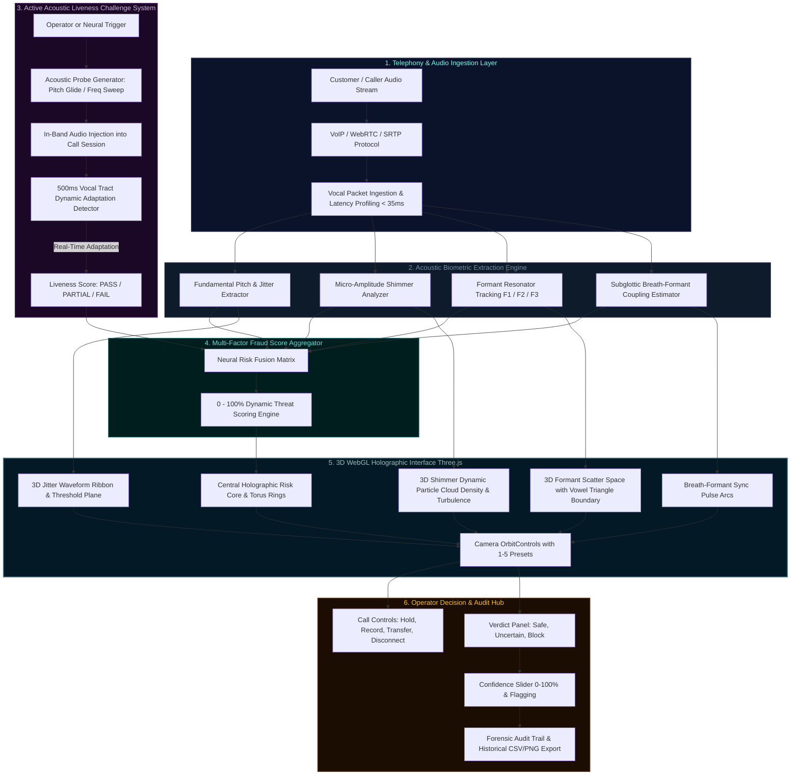

# 🛡️ VoiceGuard 3D Interactive Model
### Real-Time 3D Acoustic Forensic Biometrics & Anti-Voice-Clone Call Center Security Console
**Built for Team BharatMind | BUILD WITH भारत 2.0**

[](https://github.com/ashwinm-08/VoiceGuard-3D)
[](https://www.typescriptlang.org/)
[](https://react.dev/)
[](https://threejs.org/)
[](https://tailwindcss.com/)
[](#)

---

## 🏛️ System Architecture Diagram



---

## 🎨 Interactive HUD Architecture

```
┌─────────────────────────────────────────────────────────────────────────────────────────────┐
│  VOICEGUARD 3D  •  TEAM BHARATMIND  |  BUILD WITH भारत 2.0                 [LIVE TELEMETRY] │
├─────────────────────────────────────────────────────────────────────────────────────────────┤
│  Caller: Rajesh Sharma (USR-8942) | Duration: 02:45 | Ping: 24ms | Status: ACTIVE (SRTP)    │
│  Simulate: [🟢 Safe Caller]   [🟡 Borderline Stressed]   [🔴 AI Voice Clone Attack]         │
├───────────────────────────────────────────────────────────────┬─────────────────────────────┤
│                                                               │     CENTRAL RISK GAUGE      │
│                     THREE.JS 3D VIEWPORT                      │             ╭───╮           │
│                                                               │            │ 15% │          │
│   [1] Front  [2] Top  [3] Side  [4] Free  [5] Focus           │             ╰───╯           │
│                                                               │         ABSOLUTELY SAFE     │
│   • Central Pulsing Holographic Core                          ├─────────────────────────────┤
│   • 3D Frequency Jitter Ribbon (0.5% - 2.4% Zone)             │ ACOUSTIC LIVENESS CHALLENGE │
│   • 3D Shimmer Particle Cloud (Sparse green / Dense red)      │  [+ Trigger Challenge (C)]  │
│   • 3D Formant Scatter Space inside Vowel Triangle (/i/,/u/,/a/) Adaptation: 92% (PASS ✓)   │
│   • Dual Respiratory-Resonance Coupling Waves                 ├─────────────────────────────┤
│   • Acoustic Probe Shockwaves on Challenge Trigger            │       CALL CONTROLS         │
│                                                               │ [HOLD]   [RECORD]   [DISC]  │
│                                                               │ [MUTE]   [TRANSFER] [TLS]   │
├───────────────────────────────────────────────────────────────┼─────────────────────────────┤
│                     LIVE TELEMETRY ROW                        │     MAKE YOUR DECISION      │
│  ┌──────────────┐ ┌──────────────┐ ┌──────────────┐ ┌────────┐│ [✓ SAFE] [? UNCERTAIN] [✗]  │
│  │ JITTER: 1.1% │ │ SHIMMER: 1.8dB│ │FORMANTS: /i/ │ │BREATH: ││ Confidence Slider: 85%      │
│  │ ~~~Wavy~~~~~ │ │ ▌▌▌▌▌▌▌▌▌▌▌▌ │ │ F1-F3 Res.   │ │ 94%Sync││ [+ Add Note] [🚩 Flag]      │
│  └──────────────┘ └──────────────┘ └──────────────┘ └────────┘│ [✓ Verdict Logged in Audit] │
└───────────────────────────────────────────────────────────────┴─────────────────────────────┘
```

---

## 📖 Quick Navigation
- [🏛️ System Architecture](#️-system-architecture-diagram)
- [🖥️ Desktop Controls](#️-desktop-controls)
- [📱 Mobile Controls](#-mobile-controls)
- [📊 Understanding Each Metric](#-understanding-each-metric)
- [🎯 Common Workflows](#-common-workflows)
- [🔧 Troubleshooting](#-troubleshooting)
- [⌨️ Keyboard Shortcuts](#️-keyboard-shortcuts)
- [🚀 Quickstart & Setup](#-quickstart--setup)

---

## 🖥️ DESKTOP CONTROLS

### Mouse & Keyboard 3D Orbit Navigation
- **LEFT MOUSE DRAG**: Rotate 3D scene 360°
- **MOUSE WHEEL**: Zoom in/out smoothly
- **RIGHT MOUSE DRAG**: Pan camera (up/down/left/right)
- **DOUBLE-CLICK**: Reset to default front perspective

### Camera Preset Views (Press Number Keys):
- **`[1]` Front View**: Default operational HUD perspective
- **`[2]` Top View**: Spatial overview of all biometric nodes
- **`[3]` Side View**: 30-second temporal history ribbon
- **`[4]` Free Look**: Isometric free exploration mode
- **`[5]` Call Focus**: Close-up zoom on central caller identity and biometrics

### Interactive Actions:
- **HOVER**: Shows real-time raycasted tooltip with biometric contribution percentages.
- **CLICK**: Expands into full-screen detailed forensic modal with 60-second historical chart.
- **RIGHT-CLICK**: Context menu to export CSV datasets, capture PNG images, or compare against reference synthetic clones.
- **SHIFT + CLICK**: Multi-select metrics for side-by-side comparison.

---

## 📱 MOBILE CONTROLS
- **One Finger Drag**: Rotate 3D scene
- **Pinch**: Smooth zoom in/out
- **Two-Finger Drag**: Pan camera translation
- **Double-Tap**: Reset view to default front orientation
- **Bottom Navigation Tabs**: `[Call]`, `[Metrics]`, `[3D View]`, `[Controls]`
- **Target Ergonomics**: All touch targets adhere to ≥44×44px standards with ≥12px padding

---

## 📊 UNDERSTANDING EACH METRIC

| Metric | Normal Range (Human) | Borderline (Monitor) | Synthetic Threat (Clone) | Action |
|---|---|---|---|---|
| **Central Risk Meter** | 0 - 40% (Cyan/Green) | 41 - 60% (Yellow) | 61 - 100% (Orange/Red) | Block if >80% |
| **Jitter (Frequency Wobble)** | 0.5% - 2.4% | 2.4% - 3.5% | Flatline (<0.2%) or >3.5% | High perturbation |
| **Shimmer (Amplitude Drift)** | 0.6 - 3.5 dB | 3.5 - 4.5 dB | Dense Cloud (>4.5 dB) | Volume instability |
| **Formant Tracking (F1-F3)** | Inside Vowel Triangle | Boundary drift | Outlier points | Vocal tract disconnect |
| **Breath-Formant Sync** | 0.8 - 1.0 (Coupled) | 0.4 - 0.7 (Partial) | 0.0 - 0.3 (Decoupled) | Lungs absent in AI |
| **Acoustic Challenge** | 80 - 100% (PASS) | 50 - 79% (PARTIAL) | 0 - 49% (FAIL) | Real-time liveness test |

---

## 🎯 COMMON WORKFLOWS

### Task 1: Quick Call Assessment (30 Seconds)
1. Glance at Central Risk Gauge: Is it in the green zone (0-40%)?
2. Check Jitter & Shimmer baseline ribbons.
3. If borderline (40-60%), trigger the Acoustic Liveness Challenge (`C`).
4. On `PASS`, click `[✓ SAFE]` (or press `S`) to confirm call validity.

### Task 2: High-Risk Call Investigation (2 Minutes)
1. **🚨 Red Alert Banner** appears: Threat score exceeds 80%.
2. Inspect Formant scatter plot (verify points scattered outside the vowel space).
3. Inspect Breath Coupling score (score < 0.3 confirms synthetic speech without physical lung respiration).
4. Click `[+ Trigger Challenge]` to inject subtle acoustic modulation probe (AI voice models fail to alter phonation live in 500ms).
5. Set confidence slider to 90%+, add note: *"Decoupled breathing and failed liveness challenge"*.
6. Click `[✗ BLOCK]` (or press `B`) to terminate the session immediately.

---

## ⌨️ KEYBOARD SHORTCUTS

| Key | Action | Scope |
|---|---|---|
| `1` - `5` | Switch 3D Camera Preset Views | 3D Viewport |
| `S` | Submit Verdict: `[✓ SAFE]` | Call View |
| `U` | Submit Verdict: `[? UNCERTAIN]` | Call View |
| `B` | Submit Verdict: `[✗ BLOCK]` | Call View |
| `P` | Toggle `HOLD` / `RESUME` | Call View |
| `M` | Toggle `MUTE` Microphone | Call View |
| `C` | Trigger Acoustic Liveness Challenge | Call View |
| `R` | Toggle Audio Evidence Recording | Call View |
| `D` | Toggle Dark / Light Theme | Global |
| `F` | Toggle Fullscreen Mode | 3D Canvas |
| `H` | Open Complete Built-In User Guide & Help | Global |
| `Esc` | Close Active Modal / Menu | Global |
| `Ctrl + ,` | Open Settings & Preferences | Global |
| `Ctrl + S` | Export Historical Telemetry CSV | Global |

---

## 🚀 QUICKSTART & SETUP

### Prerequisites
- Node.js (v18+)
- npm (v9+)

### Installation & Local Run
```bash
# 1. Clone the repository
git clone https://github.com/ashwinm-08/VoiceGuard-3D.git
cd VoiceGuard-3D

# 2. Install dependencies
npm install

# 3. Start development server
npm run dev

# 4. Build optimized production bundle
npm run build

# 5. Preview production build
npm run preview
```

---

## 📞 Support & Credits
- **Project**: VoiceGuard 3D Interactive Model
- **Team**: Team BharatMind
- **Hackathon**: BUILD WITH भारत 2.0
- **Official Inquiries**: `support@voiceguard.ai`
