# 🛡️ VoiceGuard 3D Interactive Model
### Real-Time 3D Acoustic Forensic Biometrics & Anti-Voice-Clone Call Center Security Console
**Built for Team BharatMind | BUILD WITH भारत 2.0**

[](https://github.com/ashwinm-08/VoiceGuard-3D)
[](https://voiceguard-3d.vercel.app)
[](https://www.typescriptlang.org/)
[](https://react.dev/)
[](https://threejs.org/)
[](https://tailwindcss.com/)
[](#)

> 🚀 **Live Demo on Vercel**: [https://voiceguard-3d.vercel.app](https://voiceguard-3d.vercel.app)

---

## 🏛️ Comprehensive System Architecture

```mermaid
graph TB
    subgraph INGESTION["1. Telephony & Acoustic Ingestion Layer"]
        A1[Customer / Caller Audio Stream] --> A2[VoIP / WebRTC / SRTP Protocol]
        A2 --> A3[Vocal Packet Ingestion & Latency Profiling < 35ms]
        A3 --> A4[Language Identification: English / Hindi / Multi-Lingual]
        A3 --> A5[Acoustic Environment Classification: Domestic vs Synthetic Reverb]
    end

    subgraph FORENSICS["2. Multi-Tier Acoustic Forensic Extraction Engine"]
        A3 --> B1[Glottal Pulse Jitter & Frequency Wobble Extractor]
        A3 --> B2[Micro-Amplitude Shimmer Instability Analyzer]
        A3 --> B3[3D Formant Resonator Tracking: F1, F2, F3 Frequencies]
        A3 --> B4[Subglottic Breath-Formant Dynamic Bio-Coupling]
        A3 --> B5[TTS Engine Fingerprinter: ElevenLabs, Amazon Polly, WaveNet]
        A3 --> B6[Psychological Emotion & Manipulation Detector]
    end

    subgraph PROBE["3. Active Acoustic Liveness Challenge Engine"]
        C1[Operator or Neural Trigger] --> C2[Probe Synth: Pitch-Glide / Frequency Sweep / Harmonics]
        C2 --> C3[In-Band Audio Injection into Call Session]
        C3 --> C4[500ms Vocal Tract Dynamic Adaptation Profiler]
        C4 -->|Biometric Phonation Shift| C5[Liveness Verdict: PASS / PARTIAL / FAIL]
    end

    subgraph NLP["4. Real-Time NLP & Speech-to-Text Audit"]
        A3 --> D1[Live STT Speech-to-Text Transcription Stream]
        D1 --> D2[Social Engineering & Fraud Keyword Scanner: OTP / Urgency / Wire]
        D2 --> D3[AI Supervisor Real-Time Coach Recommendations]
        D3 --> D4[Out-of-Band 2FA Knowledge Questions Challenge]
    end

    subgraph FUSION["5. Multi-Factor Fraud Score Aggregator"]
        B1 & B2 & B3 & B4 & B5 & B6 & C5 & D2 --> E1[Neural Risk Fusion Matrix]
        E1 --> E2[0 - 100% Dynamic Threat Scoring Engine]
        E2 --> E3[10-Second Predictive Fraud Trend Forecasting]
    end

    subgraph HUD3D["6. Immersive 3D WebGL Holographic Engine Three.js"]
        E2 --> F1[360° Threat Analysis Dome & Risk Ripples]
        F1 --> F2[Mode 1: Central Holographic Risk Orb & Concentric Rings]
        F1 --> F3[Mode 2: Voice Signature DNA Double Helix 4 Strands]
        F1 --> F4[Mode 3: Frequency Heatmap 3D Tower Equalizer]
        F1 --> F5[Mode 4: 3D Call Network Graph Fraud Ring Clusters]
        F1 --> F6[Mode 5: Neural Network Confidence Flow Explainable AI]
    end

    subgraph DECISION["7. Analyst Decision Suite & Biometric Privacy"]
        F1 --> G1[Call Controls: Hold, Record, Transfer, Disconnect]
        F1 --> G2[Operator Verdicts: Safe, Uncertain, Block + Confidence Slider]
        G2 --> G3[Biometric Privacy Shield: AES-256 + 30s Auto Session Purge]
        G2 --> G4[Gamification Hub: Badges, Skill Tree & Leaderboard]
        G2 --> G5[Time-Rewinding VR Timeline Scrubber & Forensic Export]
    end

    style INGESTION fill:#0b132b,stroke:#1c2541,stroke-width:2px,color:#6fffe9
    style FORENSICS fill:#0d1b2a,stroke:#1b263b,stroke-width:2px,color:#778da9
    style PROBE fill:#1a0826,stroke:#3b1354,stroke-width:2px,color:#d8b4e2
    style NLP fill:#1f1300,stroke:#573b00,stroke-width:2px,color:#ffd166
    style FUSION fill:#001e1d,stroke:#004b49,stroke-width:2px,color:#64dfdf
    style HUD3D fill:#031926,stroke:#468189,stroke-width:2px,color:#9dbebb
    style DECISION fill:#1c0d02,stroke:#4d2600,stroke-width:2px,color:#ffbe0b
```



---

## 🎨 Interactive HUD Layout

```
┌────────────────────────────────────────────────────────────────────────────────────────────────────────┐
│  VOICEGUARD 3D  •  TEAM BHARATMIND  |  BUILD WITH भारत 2.0                        [127+ UNIQUE FEATURES]│
├────────────────────────────────────────────────────────────────────────────────────────────────────────┤
│  Caller: Rajesh Sharma (USR-8942) | Lang: Hindi/English | Env: Domestic Room | Duration: 02:45 | 24ms  │
│  TTS Model: ElevenLabs v2.5 (96.8%) | Emotion: Calm (96% Auth) | ⏱️ AES-256 Purge: 28s [Instant Purge] │
│  Simulate: [🟢 Safe Caller]   [🟡 Borderline Stressed]   [🔴 AI Voice Clone Attack]                    │
├────────────────────────────────────────────────────────────────────────┬───────────────────────────────┤
│                          THREE.JS 3D VIEWPORT                          │      CENTRAL RISK GAUGE       │
│                                                                        │              ╭───╮            │
│   MODE: [Vocal Hologram] [Voice DNA Helix] [3D Freq Tower]             │             │ 15% │           │
│         [Neural AI Flow] [Fraud Ring Graph]                            │              ╰───╯            │
│                                                                        │          ABSOLUTELY SAFE      │
│   CAM:  [1] Front   [2] Top   [3] Side   [4] Free   [5] Focus          ├───────────────────────────────┤
│                                                                        │  REAL-TIME TRANSCRIPTION NLP  │
│   • 360° Threat Analysis Dome with Animated Risk Ripples               │  [00:10] Caller: bypass OTP!  │
│   • Voice Signature DNA Double Helix (Unzips on synthetic clone!)      ├───────────────────────────────┤
│   • 3D Frequency Spectrogram Heatmap Tower (0-8kHz amplitude)          │  ACOUSTIC LIVENESS CHALLENGE  │
│   • 3D Call Network Graph (Coordinated Fraud Rings & Ringleader nodes) │   [+ Trigger Challenge (C)]   │
│   • Explainable Neural Decision Flow with Synaptic Pulses              │  Adaptation Score: 92% (PASS) │
├────────────────────────────────────────────────────────────────────────┼───────────────────────────────┤
│                     LIVE TELEMETRY & STATS ROW                         │         CALL CONTROLS         │
│  [VOICE HUD: Say "What's the risk?" | "Trigger challenge" | "Block"]   │  [HOLD]   [RECORD]   [DISC]   │
│  [VR TIME-REWIND: Drag -60s slider to forensic rewind biometrics]     │  [MUTE]   [TRANSFER] [2FA Q]  │
│  ┌──────────────┐ ┌──────────────┐ ┌──────────────┐ ┌────────────────┐ ├───────────────────────────────┤
│  │ JITTER: 1.1% │ │ SHIMMER: 1.8dB│ │FORMANTS: /i/ │ │BREATH: 94%Sync │ │      MAKE YOUR DECISION       │
│  └──────────────┘ └──────────────┘ └──────────────┘ └────────────────┘ │  [✓ SAFE]  [? UNCERTAIN] [✗]  │
│  Widgets: [Duration: 02:45] [248 Screened] [94.3% Acc] [42ms Latency]  │  Confidence Slider: 85%       │
└────────────────────────────────────────────────────────────────────────┴───────────────────────────────┘
```

---

## 🌟 Complete 127+ Unique Feature Catalog Highlights

### 🎨 Section 1: Advanced 3D Visualization Features
- **1.1 Holographic Call Interface**: Translucent depth panels, holographic scanning lines, glowing cyan refractions, and floating biometrics.
- **1.2 Real-Time Audio Waveform in 3D Space**: 3D spatial ribbon with time, amplitude, and frequency elevation.
- **1.3 Animated Risk Ripple Effect**: Concentric water-ripple circles that expand when risk increases, color-coded green to red.
- **1.4 Frequency Heatmap 3D Tower**: 32-bar animated 3D equalizer tower showing 0-8kHz distribution with hot/cool thermal gradients.
- **1.5 Neural Network Confidence Visualization**: 3D interconnected neural classifier nodes showing explainable AI decision paths.
- **1.6 Immersive 360° Threat Analysis Dome**: Transparent bounding security dome that turns red and alerts during critical deepfake threats.
- **1.7 Voice Signature DNA Helix**: Double helix with 4 vocal strands (Pitch, Formants, Breath, Amplitude) that unzips/twists during synthetic clone attacks.
- **1.8 Adaptive Audio Particle System**: 500-particle field that reacts in real-time to vocal instability.
- **1.9 Time-Rewinding VR Timeline**: Interactive scrubber slider to rewind telemetry 60 seconds into the past to inspect exact threat moments.
- **1.10 Sentiment & Emotion Indicator**: Real-time emotion classification, authenticity score, and simulated heart rate BPM.

### 🤖 Section 2: Advanced AI/ML Features
- **2.1 Real-Time Voice Clone Detection**: Identifies specific TTS engines (ElevenLabs v2.5, Amazon Polly, OpenAI, Bark/RVC) with confidence %.
- **2.2 Behavioral Anomaly Detection**: Tracks deviation magnitude from customer's historical vocal baseline.
- **2.3 Fraud Ring Detection (3D Call Network Graph)**: Identifies synchronized attacks, spoofed SIP trunk nodes, and coordinated fraud ringleaders.
- **2.4 Adaptive Machine Learning Model**: Continuous learning from analyst verdicts with 94.3% accuracy tracking.
- **2.5 Multi-Language Voice Analysis**: Identifies English, Hindi, Gujarati, Tamil, Telugu, and detects code-switching.
- **2.6 Emotion Manipulation Detection**: Flags forced urgency scripts vs organic customer distress.
- **2.7 Environmental Noise Classification**: Differentiates quiet domestic rooms, vehicle noise, and synthetic background reverb loops.
- **2.8 Real-Time Transcription with Risk Highlighting**: Live STT dialogue stream with urgency language in orange and OTP/wire transfer keywords in red.
- **2.9 Deepfake Audio Detection**: Detects vocoder spectral phase mismatches and diffusion artifacts.
- **2.10 Caller Verification via Knowledge Questions**: Out-of-band 2FA questions challenge with instant verification.

### 💬 Section 3: Communication & Collaboration
- **3.1 AI Supervisor Assistant (Real-Time Coach)**: Floating smart recommendations ("Elevated jitter - recommend acoustic probe", "High threat - block call").
- **3.2 Biometric Privacy Shield**: Zero-knowledge proof, GDPR/PSD2 compliance badges, and 30s auto session purge countdown with manual `[Instant Purge]`.
- **3.3 Supervisor Review & Audit Log**: Comprehensive verdict submission audit trail with confidence calibration and supervisor review flags.

### 📊 Section 4: Analytics & Real-Time Stats Widgets
- **Duration**: Live call elapsed timer.
- **Daily Throughput**: 248 calls screened today (+12% vs yesterday).
- **Detection Accuracy**: 94.3% with 1.2% false positive rate.
- **Concurrent Capacity**: 12 / 32 active sessions (37.5% load).
- **Inference Latency**: 42ms with GPU acceleration.
- **Risk Breakdown**: 80% Safe 🟢, 15% Medium 🟡, 5% High 🔴.

### 🎮 Section 5: Gamification & Agent Certification
- **5.1 Achievement Badges**: Accuracy Master 🏆, Quick Draw 🎯, Eagle Eye 🔍, Rapid Response 🚀, Deepfake Hunter 💎.
- **5.2 Real-Time Leaderboard**: Compete with team members based on fraud prevented and precision scores.
- **5.3 Daily Fraud Challenge Mode**: Scenario practice with known outcomes.
- **5.4 Skill Tree Progression**: Level up in Jitter, Formants, Liveness Probes, and Deepfake Fingerprinting.

### 📱 Section 8: Voice Command Control & Ergonomics
- **Hands-Free Voice Control**: Say or click:
  - *"VoiceGuard, what's the risk?"*
  - *"VoiceGuard, trigger challenge"*
  - *"VoiceGuard, mark safe"*
  - *"VoiceGuard, block call"*
  - *"VoiceGuard, show jitter"*

---

## ⌨️ KEYBOARD SHORTCUTS REFERENCE

| Key | Action | Scope |
|---|---|---|
| `1` - `5` | Switch 3D Camera Preset Views (Front, Top, Side, Free, Focus) | 3D Viewport |
| `S` | Submit Verdict: `[✓ SAFE]` | Call View |
| `U` | Submit Verdict: `[? UNCERTAIN]` | Call View |
| `B` | Submit Verdict: `[✗ BLOCK]` | Call View |
| `P` | Toggle `HOLD` / `RESUME` | Call View |
| `M` | Toggle `MUTE` Microphone | Call View |
| `C` | Trigger Acoustic Liveness Challenge | Call View |
| `R` | Toggle Audio Evidence Recording | Call View |
| `D` | Toggle Dark / Light Theme | Global |
| `F` | Toggle Fullscreen Mode | 3D Canvas |
| `H` | Open Built-In User Guide & Help | Global |
| `Esc` | Close Active Modal / Menu | Global |
| `Ctrl + ,` | Open Settings & Preferences | Global |
| `Ctrl + S` | Export Historical Telemetry CSV | Global |

---

## 🚀 QUICKSTART & SETUP

```bash
# 1. Clone the repository
git clone https://github.com/ashwinm-08/VoiceGuard-3D.git
cd VoiceGuard-3D

# 2. Install dependencies
npm install

# 3. Start local development server
npm run dev

# 4. Build optimized production bundle
npm run build

# 5. Preview production build
npm run preview
```

---

## 📞 Support & Credits
- **Project**: VoiceGuard 3D Interactive Model
- **Team**: Team BharatMind
- **Hackathon**: BUILD WITH भारत 2.0
- **Official Inquiries**: `support@voiceguard.ai`
